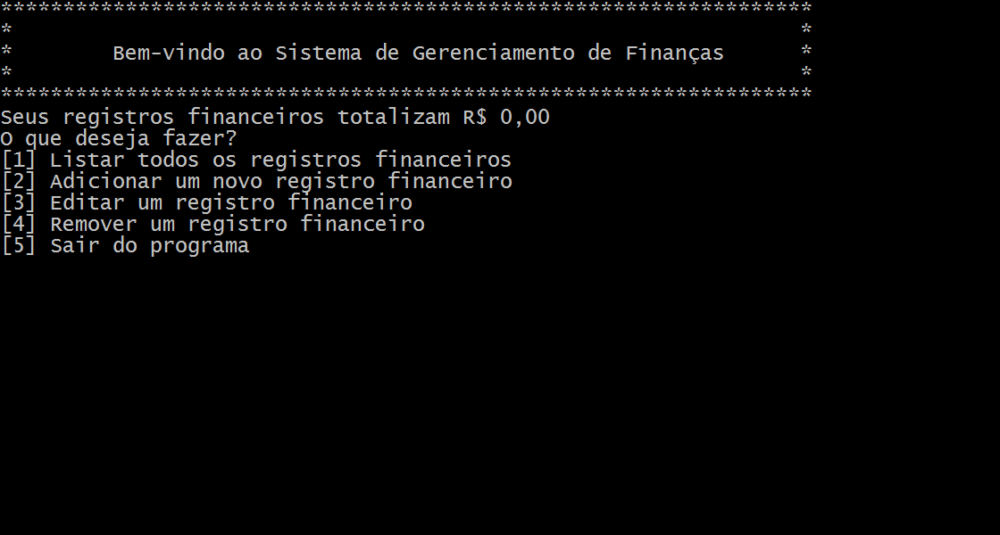
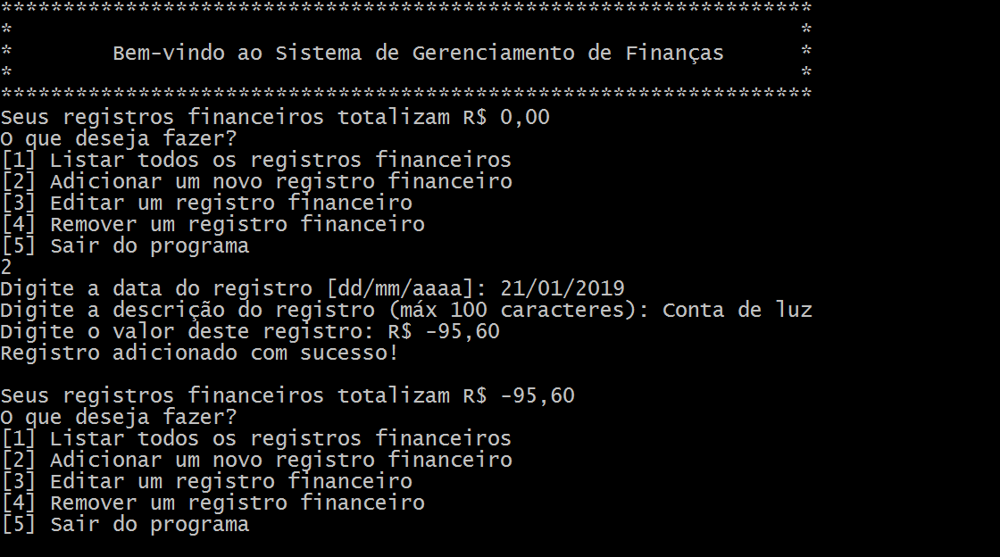

# Sistema de Registros Financeiros

Este software permitirá você gerenciar todas as suas finanças.

Com ele será possível:
- Registrar despesas;
- Registrar receitas;
- Saber o saldo de suas receitas e despesas;
- Além de poder listá-las, a fim de ver todo o histórico de registros financeiros.

## Observação

Este software, por enquanto, tem suporte a só 1 usuário, e grava todas os registros financeiros em um arquivo txt, na mesma pasta do executável, chamado "profile.txt".

## Imagens do software

## Uso

Para usar a aplicação:

  1. Fazer o download: Duas formas de baixar o sistema:
  
    - Baixando o ZIP diretamente do repositório, ou;
    - Fazendo o clone deste repositório, através do comando:
    git clone https://github.com/rt-oliveira/Sistema-de-Registros-Financeiros.git
    
  2. Compilar a aplicação: Para compilar a aplicação, basta dar o comando:
    `make `
  
  3. Está pronto para ser usado o Sistema de Registros Financeiros
  
  ## Contribuições
  
